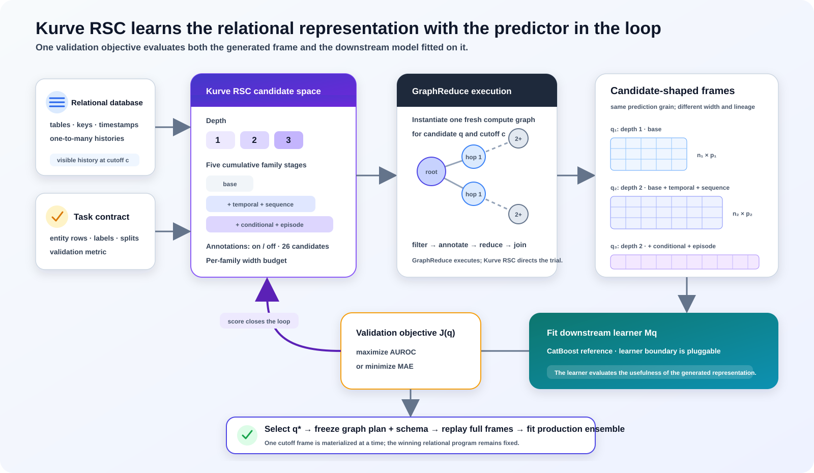
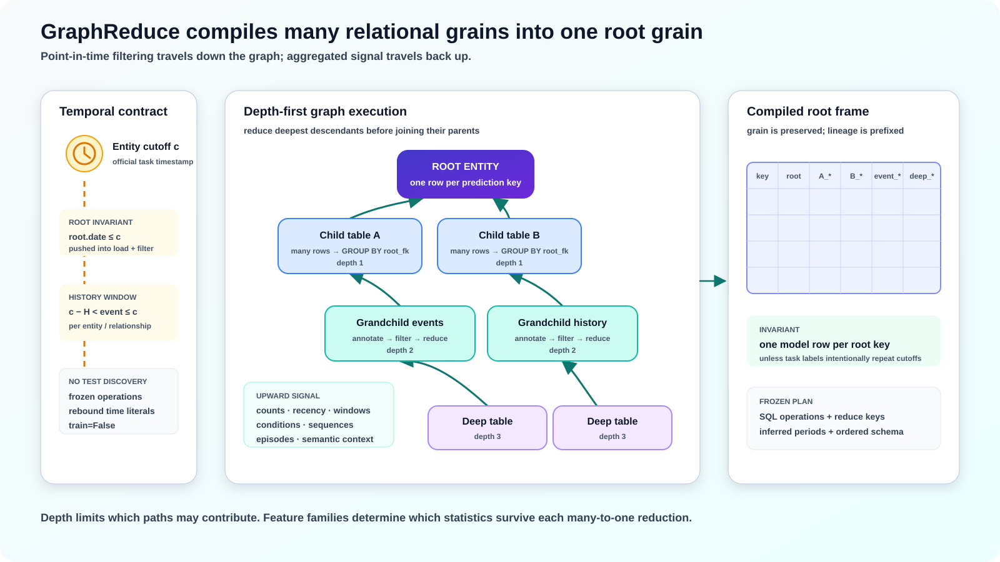

# Abstract

Relational prediction begins with a representation problem: a database contains
many tables at different granularities, whereas conventional supervised learners
consume one matrix at one prediction grain. A fixed flattening policy makes that
representation an engineering constant. KurveRSC instead treats it as a
validation-tested model choice.

KurveRSC defines a finite space of relational programs over a database compute
graph. A program chooses graph depth, a cumulative set of relational feature
families, automatic annotation policy, and feature budgets. GraphReduce executes
each program under point-in-time cutoffs and produces an entity-grain feature
frame. A downstream learner is fitted to every frame, and its held-out predictive
performance supplies the objective used to select the relational program. The
result is a fitted artifact containing both a frozen GraphReduce execution plan
and a predictive model.

The current reference implementation uses CatBoost and selects configurations by
validation AUROC for binary classification or mean absolute error (MAE) for
regression. The boundary between relational materialization and estimation is a
typed tabular frame, so the learner is replaceable; an experimental TabPFN v3
adapter demonstrates this separation. The contribution is not a new tree learner
or a differentiable database operator. It is an auditable optimization procedure
over the *relational signal-compression space*, evaluated jointly with the learner
that will consume the compressed representation.

The default reproducibility profile evaluates graph configurations on the complete
latest eligible training cutoff, executes configurations and cutoff folds
sequentially, reranks three finalists over three complete temporal folds, and fits
the production artifact on the latest eligible training cutoff. Only one relational
feature frame is resident at a time. Additional production cutoffs can improve
predictive performance on some tasks, but they are opt-in so that the reference
configuration remains practical to reproduce under bounded memory.

This report describes the GraphReduce execution algorithm, the relational feature
families, the KurveRSC meta-parameters and selection objective, temporal leakage
controls, frozen-plan lifecycle, bounded-memory implementation, and the intended
RelBench/RelArena evaluation protocol. The performance section contains the
complete 21-task controlled-run snapshot.

# Thesis

The central thesis of KurveRSC is that *relational signal compression is a
first-class, durable optimization surface*. Predictive performance depends not
only on the learner applied after data preparation, but also on which relational
paths, temporal horizons, reductions, annotations, and source columns survive the
conversion from a variable-grain database into the representation consumed by
that learner. A fixed flattening recipe hard-codes this choice; a monolithic
relational architecture hides it inside one model. KurveRSC instead exposes the
representation program, measures it jointly with the learner, and freezes the
selected program as an auditable artifact.

This view preserves learner pluggability. CatBoost is the current reference
judge, but the selected GraphReduce frame has a typed tabular boundary that can
be consumed by TabPFN-3 or another downstream learner or foundation model. The
research direction is therefore not “feature engineering instead of foundation
models.” It is task-conditioned relational compression *for* whatever learner
best exploits the resulting signal.

Recent results from two independent systems motivate this thesis. KumoRFM-2
reports that task-specific fine-tuning raises average MRR on SALT from 0.83 for
its in-context model to 0.89, compared with 0.79 for the strongest supervised
baseline in that study [15]. This is not representation-program search, but it
shows that even a strong pretrained relational model retains substantial value
in task-specific adaptation. Prior Labs' TabPFN-Rel constructs relational
features with Deep Feature Synthesis and delegates prediction to TabPFN-3 [10].
Its RelArena performance shows that a foundation learner can remain competitive
when the relational representation is built by an independent preprocessing
layer. Neither result proves KurveRSC's mechanism; together they support the
broader modular hypothesis that the relational representation and the learner
should be adapted jointly without permanently binding either layer to the other.

# Difference from relational feature synthesis

The shortest distinction is: **Deep Feature Synthesis generates a feature
space; KurveRSC selects a relational program by measuring how well its complete
feature frame works with the downstream learner.** DFS and KurveRSC are therefore
complementary ideas at different levels. DFS defines how primitives can be
composed across relationships [2]. KurveRSC defines how alternative relational
representation policies are proposed, evaluated, complexity-checked, selected,
and frozen.

| Dimension | Deep Feature Synthesis | GraphReduce | KurveRSC |
|---|---|---|---|
| Primary object | Composed feature definitions | Executable table graph and node operations | Search distribution over complete GraphReduce programs |
| Main choices | Relationships, primitive set, synthesis depth | Graph depth, node policy, feature families, cutoffs, reductions | Depth, family combinations, annotations, feature budgets, temporal policy, and learner policy |
| Downstream learner | Normally fitted after synthesis; not the DFS generation objective | External to the execution engine | In the loop: validation AUROC or MAE scores every candidate frame |
| Task adaptation | Caller selects recipe; downstream feature selection may remove columns | Caller configures a graph program | Search, confirmation, temporal reranking, and complexity/stability selection are target-conditioned |
| Temporal semantics | Depend on cutoff-time configuration supplied by the caller | Point-in-time filters and label operations are native graph operations | Cutoff-safe candidates and folds are part of selection and final replay |
| Output | Feature definitions and a materialized table | Reduced entity-grain frame plus operation lineage | Fitted artifact containing the selected graph configuration, frozen execution plan, schema, and learner |
| Inference behavior | Recompute the chosen feature definitions | Re-execute the configured graph | Replay the exact learned plan with feature discovery disabled |

This distinction also separates KurveRSC from simply placing an AutoML model
after a very wide DFS matrix. Column-level learner regularization can decide
which already-materialized columns to use, but it cannot recover relational
paths, cutoff windows, feature families, or propagation depths that were never
materialized. Conversely, exhaustively generating everything can be
computationally prohibitive and statistically noisy. KurveRSC searches those
upstream choices under explicit width and complexity controls before committing
to the final full-data representation.

RDBLearn and TabPFN-Rel demonstrate a strong DFS-to-foundation-model pipeline
[9,10]. KurveRSC generalizes a different boundary: the relational program is the
optimized object, and the frame consumer is replaceable. A DFS engine could in
principle serve as another program generator inside the same learner-guided
selection abstraction; GraphReduce is the current execution substrate because
it exposes cutoff-safe graph operations and a replayable plan.

# Introduction

Operational data is usually relational. An entity such as a customer, product,
driver, study, or advertisement is connected to transactions, events, messages,
measurements, and other entities through foreign keys. A supervised model,
however, usually expects a fixed-width matrix whose rows share one prediction
grain. Constructing that matrix requires decisions about which tables to reach,
how far to traverse, what history is visible, which reductions to apply, and how
much feature growth to tolerate.

Automatic relational feature engineering has a long history. Deep Feature
Synthesis composes aggregation and transformation primitives across relationships
[2], and OneBM develops a scalable relational feature-generation framework [3].
GraphReduce takes a graph-programming approach: tables are nodes, key
relationships are edges, and a granularity-directed depth-first traversal reduces
child histories before joining them into their parents [1]. This preserves a
declared root grain while supporting SQL execution, temporal filters, custom
operations, and automated feature families.

These systems still leave a consequential question: *which relational program
should be used for this prediction task?* Greater depth reaches more tables, and
richer feature families preserve more behavior, but additional features can be
sparse, redundant, unstable, expensive, or actively harmful to generalization.
The most elaborate graph is not necessarily the most predictive graph.

KurveRSC moves relational-program choice inside the model-selection loop. For each
candidate program, it materializes a point-in-time feature frame, fits the same
downstream learner policy, and evaluates the complete representation--learner
pair. This yields three practical properties:

1. **Task-conditioned relational representation.** The chosen view depends on the
   target, split, and learner rather than on an a priori belief that more joins are
   always better.
2. **Auditable selection.** Every candidate records its configuration, feature
   count, row count, materialization time, model time, validation score, failures,
   and complexity notes.
3. **Reproducible inference.** The winner is frozen as relational operations,
   inferred temporal periods, an ordered feature schema, and a fitted estimator.
   Inference replays this artifact without rediscovering features.

Figure 1 summarizes the system. The relational database and point-in-time task
contract enter a search over graph configurations. Each configuration changes the
reachable graph and feature policy, producing a distinct feature-frame shape. A
downstream learner scores that shape, KurveRSC selects one program, and the chosen
program is replayed for final fitting and prediction.

{width=100%}

The rest of this report is organized as follows. Section 2 formulates relational
signal compression. Section 3 describes the GraphReduce algorithm. Section 4
defines the feature families and annotations. Section 5 presents the KurveRSC
search and selection procedure. Section 6 describes final fitting and the fitted
artifact. Section 7 covers systems behavior. Section 8 specifies the benchmark
protocol and reserves the performance tables. Sections 9 and 10 discuss related
work, limitations, and future directions.

# Relational signal compression

## Database, task, and prediction grain

Let a relational database be a directed schema graph

$$
\mathcal{D}=(\mathcal{V},\mathcal{E}),
$$

where each node $v\in\mathcal{V}$ is a table and each edge $e\in\mathcal{E}$
declares a parent key, a child foreign key, and whether the child must be reduced
before joining. A task specifies:

- a root or parent table $r$ whose key defines the prediction grain;
- labeled entities and a target $y$;
- training, validation, and test cutoffs or splits;
- date keys for tables whose rows are time-dependent; and
- a classification or regression metric.

For entity $i$ and cutoff $c_i$, the eligible history is

$$
\mathcal{H}_i(c_i)=
\left\{x\in\mathcal{D}: c_i-H < t(x) \le c_i\right\},
$$

where $t(x)$ is a row timestamp and $H$ is the configured compute horizon. The
upper-bound convention is implemented explicitly at the KurveRSC root boundary;
GraphReduce's native feature windows remain strict internally where required. No
row after the entity cutoff may contribute to its features.

## A graph configuration is a representation hypothesis

KurveRSC represents a relational program by

$$
q=(d,\mathcal{A},a,b,x),
$$

where:

- $d$ is the maximum backward graph depth;
- $\mathcal{A}$ is the ordered, cumulative set of feature families;
- $a\in\{0,1\}$ controls automatic annotation;
- $b$ is the per-family source-column or predicate budget; and
- $x$ contains optional text-annotation policy.

Executing $q$ at cutoff $c$ produces

$$
F_q(c)=\operatorname{GraphReduce}(\mathcal{D},r,c,H;q)
       \in \mathbb{R}^{n_q(c)\times p_q(c)}.
$$

The root key fixes the intended row grain. The feature width and lineage depend
on the tables reachable within $d$, their types and values, the selected families,
annotations, inferred lookbacks, and the budget $b$. In practice, entity
eligibility can also change the observed row count. KurveRSC therefore records
both $n_q$ and $p_q$ for every trial.

We call this *relational signal compression* because a variable-size collection
of related histories is compiled into a bounded entity vector. Compression here
does not mean a learned low-dimensional embedding. It means a deterministic,
lineage-preserving reduction from a multi-table history to a tabular
representation at the target grain.

{width=100%}

## The learner closes the objective loop

Let $\lambda$ denote a downstream learner policy (backend and fixed
hyperparameters). For candidate $q$,

$$
\theta_q=\operatorname{Fit}_{\lambda}
\left(F_q^{\mathrm{train}},y^{\mathrm{train}}\right),
$$

and

$$
J(q;\lambda)=
\operatorname{Metric}\left(
\theta_q,F_q^{\mathrm{validation}},y^{\mathrm{validation}}
\right).
$$

The raw winner is

$$
q_{\mathrm{raw}}=
\begin{cases}
\arg\max_q J(q;\lambda), & \text{binary classification AUROC},\\
\arg\min_q J(q;\lambda), & \text{regression MAE}.
\end{cases}
$$

This is a joint empirical objective over representation and learner behavior:
the score is meaningful only after the learner has consumed the generated frame.
It is not end-to-end differentiation through SQL. In the default implementation,
$\lambda$ is held fixed while $q$ varies, which isolates relational representation
quality. The API permits a different backend or caller-supplied model parameters;
a broader AutoML layer could optimize $(q,\lambda)$ jointly in future work.

# GraphReduce execution algorithm

## Graph representation and directional reduction

GraphReduce models tables as nodes and relationships as directed edges [1]. A
node owns its source, primary key, optional date key, prefix, and table-local
operations. An edge declares how the child key maps to the parent key and whether
the child must be aggregated before the join.

The central invariant is grain preservation. For a one-to-many relationship, a
raw child join would duplicate the parent. GraphReduce instead visits the deepest
reachable children first, reduces each child by the relationship key, joins the
result into its parent, and repeats toward the root. Deep descendants are thus
compressed before their information propagates upward.

{width=100%}

For a path $r\leftarrow v_1\leftarrow\cdots\leftarrow v_k$, let
$R_{v_j\rightarrow v_{j-1}}$ denote the key-grouped reduction of node $v_j$.
The propagated representation is recursively

$$
Z_{v_{j-1}} = X_{v_{j-1}}\ \bowtie\
R_{v_j\rightarrow v_{j-1}}(Z_{v_j}),
$$

and the final frame is $Z_r$. Prefixes and deterministic aliases retain column
lineage across repeated aggregation.

## Execution phases

At a high level, GraphReduce executes the following program:

```text
Input: graph G, root r, cutoff c, compute horizon H,
       feature policy A, optional frozen plan P

1. Hydrate graph-level parameters onto nodes.
2. Load each table and assign collision-safe prefixes.
3. Annotate node-local values and the dated root's age at cutoff c.
4. Apply node filters and normalization operations.
5. Propagate entity-specific cutoff context through reachable relationships.
6. Traverse reducible edges deepest-child first:
     a. restrict dated child rows to (c - H, c];
     b. infer or replay annotation and feature operations;
     c. group by the child foreign key and aggregate;
     d. join the reduced child into its parent.
7. If training labels are graph-generated, execute the future-label window
   separately through GraphReduce's label operations.
8. Return the root-grain frame and, during planning, the executed SQL plan.
```

The same abstraction supports custom node operations. KurveRSC deliberately uses
GraphReduce's native `prep_for_features()`, `prep_for_labels()`, `do_reduce()`,
and `do_labels()` lifecycle rather than inventing a second label-generation
system. External benchmarks such as RelBench supply labels and official cutoffs;
native GraphReduce tasks may instead generate labels from a connected label node.

## Point-in-time correctness

Temporal correctness is enforced at multiple boundaries:

1. **Root filtering.** When the parent has a date key, KurveRSC inserts
   `date <= cutoff` into both the root load and GraphReduce filtering stages.
   This prevents post-cutoff parent rows from reaching schema inference,
   annotation, or joins.
2. **Relationship windows.** A dated child is filtered to the configured compute
   horizon before reduction. If entity-specific cutoff rows are used, the cutoff
   is propagated down the graph so every related event is compared against the
   correct entity timestamp.
3. **Label separation.** Feature history ends at the cutoff. Graph-generated
   labels use GraphReduce's label period after the cutoff, while external labels
   follow the benchmark's official task construction.
4. **Plan replay.** Cutoff-dependent literals in a frozen plan are rebound to the
   new cutoff while the learned operations and schema remain unchanged.
5. **Test isolation.** Test targets do not participate in graph configuration,
   annotation discovery, inferred periods, schema selection, or model fitting.

RelBench defines official database truncation, temporal splits, task labels, and
evaluation contracts for RelBenchV1 [4]. The KurveRSC RelBench adapter consumes
those production objects instead of reconstructing task semantics from local
assumptions.

## Automatic event-frequency inference

A fixed lookback grid is not equally appropriate for daily clicks, monthly
orders, and sparse study events. With `infer_ts_periods=True`, GraphReduce infers
lookback periods per dated node and relationship. For each relationship key it
computes first timestamp, last timestamp, and event count, then estimates an
average cadence from duration and count.

Let $D$ be mean observed active duration in days, $N$ mean event count, and $H$
the actual graph compute horizon. GraphReduce builds candidate windows from
ratios of $D$ and $H$, retains cadence and horizon anchors, rounds long windows
to stable calendar-like intervals, and selects between five and ten distinct
periods depending on duration and event density. Every inferred period is bounded
by $H$; the final grid always spreads short-, medium-, and long-range windows over
the actual compute horizon.

The selected periods become part of the frozen execution plan. Validation,
historical replay, and test inference restore them rather than re-estimating them
from later data.

## Frozen execution plans

Automatic feature generation can depend on observed types, cardinalities,
frequent categories, or available annotations. Rediscovering these choices at
each cutoff could silently change feature meaning. GraphReduce therefore records
the executed operations, date-filter operations, reduction keys, inferred
periods, and original planning cutoff. KurveRSC augments the plan with the ordered
model feature schema and categorical/datetime roles.

For a later cutoff $c'$, plan replay:

- preserves the exact selected operations and aliases;
- rebinds cutoff and lookback literals from $c$ to $c'$;
- restores inferred `ts_periods`;
- prohibits feature rediscovery; and
- aligns the resulting frame to the training-derived schema.

A deterministic fingerprint identifies the production plan stored in the fitted
artifact.

# Relational feature construction

## Type-aware base reductions

GraphReduce infers semantic and physical types from a bounded sample, excludes
keys from inappropriate aggregation, and emits SQL aggregations compatible with
the selected backend. The conservative base behavior includes:

- row or identifier counts;
- numerical `sum`, `avg`, `min`, and `max` where type-safe;
- Boolean sums;
- bounded categorical counts and frequent-value summaries;
- time since the last event;
- event counts inside configured windows and adjacent-window change ratios; and
- bounded frequent predicates with windowed counts, lag-bucket counts, and
  time since the last matching event.

GraphReduce avoids numeric SQL functions on physically non-numeric values, even
when a sample-level semantic inference is ambiguous. This type guard is important
for production relational data, where an all-null sample can otherwise be exposed
by a SQL engine as a string-typed placeholder.

## Automatic annotations

Annotations convert row-level values into aggregation-friendly signals before
the child is reduced. When `auto_annotate_features=True`, GraphReduce can emit:

- indicators for bounded-cardinality categorical values;
- top-$k$ indicators and an `other` bucket for higher-cardinality categories;
- category-gated numerical values, such as amount when status equals a frequent
  category;
- caller-provided predicate or value expressions; and
- optional text-shape features: character length, word count, number presence,
  URL presence, and empty-text indicators.

The dated graph parent receives an age-in-days feature relative to the cutoff,
independent of whether generic automatic annotations are enabled. Annotation
budgets prevent one wide source table from dominating the graph.

## Feature families

GraphReduce implements seven feature families. KurveRSC searches independent
subsets of the four general-purpose optional families rather than requiring a
weak earlier family to remain in every later candidate. A forward beam controls
the resulting combinatorial growth.

| Family | Signal preserved | Principal operations |
|---|---|---|
| `base` | Stable type-aware summaries and first-order recency | Counts; numeric reductions; categorical summaries; recency; rolling counts and changes; bounded predicate histories |
| `temporal` | Magnitude and distribution of numerical behavior over time | Windowed sum, average, minimum, and maximum for selected numeric or annotated columns |
| `sequence` | Trajectory, concentration, and burstiness | Activity rate per day; recent-window share of lifetime activity; adjacent-window burst ratios; active span; activities per active day |
| `conditional` | Behavior under categorical or semantic conditions | Windowed conditional count, share, presence, and adjacent-window change |
| `episode` | Exposure and distinct-event opportunity | Lifetime and windowed row counts; distinct primary-key counts where supported |
| `semantic` | Caller-declared domain meaning | Predicate and value expressions compiled to annotated columns and consumed by ordinary reductions |
| `context` | Peer-relative row context before reduction | Peer-group size and bounded numeric deviations over caller-declared context keys |

`semantic` and `context` remain available in GraphReduce but are omitted from the
default KurveRSC frontier. Semantic expressions require domain declarations, and
context features require meaningful context keys; neither can be assumed for a
fully generalized task. Their signals can still be supplied through explicit
`GraphConfig` candidates.

## Feature budgets and controlled width

KurveRSC fits a deterministic source-column ordering on a small sample from each
node. Structural join and cutoff columns are retained first; remaining columns
are ranked by observed coverage, entropy, spread, and cardinality, with
effectively unique identifiers down-weighted. This ordering replaces physical
schema order as the input to the capped feature funnel and is returned as
`feature_audit`.

Three independent width controls are frozen in each graph program:

1. `feature_family_max_columns=b` limits selected source columns per family and
   node;
2. `feature_family_max_features_per_column=r` limits the derived SQL features
   emitted by each selected source column within a family; and
3. `feature_propagation_max_functions_per_column=p` limits the functions emitted
   when an already-derived column crosses another reduction.

For $p=1$, propagation retains the canonical associative or additive
continuation: max-to-max, min-to-min, sum-to-sum, count-to-sum, and
average/share-to-average. Thus a useful lineage such as
`max(max(max(value)))` can cross three hops without branching into every
compatible aggregation at every hop.

KurveRSC currently fixes several lower-level GraphReduce policies across graph
trials so the main meta-parameter comparison remains interpretable:

| GraphReduce policy | KurveRSC reference value |
|---|---:|
| Initial lookback periods | 7, 30, and 90 days |
| Categorical cardinality threshold | 20 |
| Frequent-category top-$k$ | 5 |
| Maximum auto-annotated categorical columns | 10 |
| Maximum gated numeric columns | 4 |
| Categories per gated numeric column | 3 |
| Initial / promoted source-column budgets | 4 / 8 |
| Derived features per selected source column | 32 |
| Aggregate functions per propagated column | 1 |
| Text features | Disabled by default |

When event-frequency inference is enabled, its learned periods replace the
initial lookback grid for the affected node or relationship.

# KurveRSC meta-optimization

## Search dimensions

The default KurveRSC frontier independently varies four primary meta-parameters:

1. **Depth** $d\in\{1,2,3\}$, controlling how many backward relational hops may
   contribute to the root.
2. **Feature-family subset** $\mathcal{A}$, controlling which kinds of
   relational signal survive compression.
3. **Automatic annotation** $a\in\{\text{on},\text{off}\}$, testing whether
   inferred categorical and gated-numeric predicates help the task.
4. **Source-column budget** $b$, fixed at four by default and optionally
   refined to a caller-requested wider tier for the strongest shapes.

The optional-family set is:

```text
base + any subset of {temporal, sequence, conditional, episode}
```

Depth 3 is evaluated only when the family subset is contained in `base`,
`temporal`, and `sequence`. Candidates containing `conditional` or `episode`
are limited to depths 1 and 2. With both annotation settings, one source-column
budget has 72 potential graph shapes:

$$
(4\text{ compact subsets})(3\text{ depths})(2\text{ states})
+(12\text{ wider subsets})(2\text{ depths})(2\text{ states})=72.
$$

The narrow-budget forward beam materializes at most 24 of those shapes. Both
annotation states are screened at base depth 1, only the stronger state is
promoted to depth 2, and depth 3 requires a meaningful depth-2 gain. This
admits at most four base variants; beam width two admits at most 8, 6, 4, and 2
descendants at the successive optional-family levels. The other shapes remain
in the audit as pruned candidates. An optional second 72-shape lattice can
represent an eight-column budget, but only the raw narrow-budget winner and its
complexity-aware recommendation are promoted; the next score-ranked shape fills
the second slot when those are identical. The default funnel therefore contains
72 auditable potential candidates and normally materializes no more than 24.

The user may change `max_depth`, family stages, annotation options, and feature
budgets, or supply an explicit list of `GraphConfig` objects. Optional text
features apply consistently to those candidates. Graph search is therefore
bounded by default but not hard-coded to one benchmark.

## Screening protocol

Each configuration receives a fresh GraphReduce instance because graph execution
creates intermediate state. A screening trial performs the following steps:

```text
rank source columns and freeze the feature-funnel audit
for q in forward_beam(candidate_graph_configs):
    build a fresh depth-bounded graph for q
    materialize the latest eligible training cutoff
    learn and freeze q's GraphReduce operations and feature schema
    fit the downstream learner on that training frame
    stream validation cutoff frames through the frozen plan
    aggregate predictions and compute AUROC or MAE
    record score, standard error, rows, columns, timings, plan, and failures
promote only the strongest complete shapes to the wider column budget
```

The report's default reproducibility profile sets `search_full_data=True`: every
beam-admitted graph configuration is evaluated against the complete source tables
at the latest eligible training cutoff. The strongest three configurations are
then reranked on three sequential complete relational cutoff folds. This is the
configuration used for the primary result tables unless a row is explicitly
identified as an ablation or retry.

For lower-cost exploratory runs, `search_full_data=False` enables the public API's
three-fidelity funnel. Beam-admitted candidates are screened with
`screening_rows=10000`; `confirmation_top_k=8` structurally diverse candidates
are rebuilt with `sample_rows`; and the strongest `rerank_top_k` candidates are
reranked on complete folds. Every mode searches exactly one training cutoff per
node at a time and executes candidates sequentially.

| Reference-stage choice | Parameterized setting |
|---|---|
| Complete latest-cutoff graph search | `search_full_data=True` |
| Sequential graph candidates | intrinsic per-task execution policy |
| Full-data finalists | `rerank_top_k=3` |
| Sequential stability folds | `rerank_cutoff_frames=3` |
| Final production cutoffs | `full_training_frames=1` |
| Inferred event periods | `infer_ts_periods=False` |
| Automatic text annotations | `auto_text_features=False` |

Validation cutoffs are materialized one at a time. Once the learner has produced
predictions, the frame is released. This preserves the meaning of the metric
while bounding resident feature-frame memory.

{width=100%}

## High-resource buffered multi-cutoff profile

We additionally define a deliberately non-default experiment for machines with
hundreds of GiB of RAM. For every graph configuration, KurveRSC materializes
three evenly spaced training cutoffs, freezes the uncertain GraphReduce
operations learned at the latest of those cutoffs, replays that exact plan on
the earlier two, retains all three feature frames in RAM, concatenates them, and
fits one joint CatBoost model. Thus `search_training_frames=3` changes both the
temporal evidence and the memory contract of graph-configuration selection.

| High-resource choice | Setting |
|---|---|
| Complete source tables | `search_full_data=True` |
| Buffered graph-search cutoffs | `search_training_frames=3` |
| Full-data finalists | `rerank_top_k=3` |
| Temporal reranking folds | `rerank_cutoff_frames=3` |
| Production training cutoffs | `full_training_frames=10` |
| Per-task DuckDB memory ceiling | `duckdb_memory_limit="192GB"` |
| Per-task DuckDB spill ceiling | `duckdb_max_temp_directory_size="40GB"` |
| Concurrent RelArena tasks | `--parallel-tasks 4` |

If a task exposes fewer than three or ten eligible training cutoffs, all
available cutoffs are used. Otherwise the requested cutoffs are selected
deterministically across the task's actual training period. Reranking and final
production fitting retain their one-frame-at-a-time replay behavior; only the
three graph-search frames are intentionally co-resident. The production stage
fits up to ten independent 300-tree models and averages them as a frame
ensemble.

This profile explicitly requires a large-resource machine and is not claimed as
the RelArena reproducibility default. Four workers can reserve up to 768 GB of
DuckDB query memory before accounting for the buffered pandas frames, CatBoost,
and process overhead. The companion results must therefore report the launch
hardware, task-level peak RSS, failures, and retries separately from predictive
scores.

## Downstream learner policy

CatBoost is the current default because it provides a strong conventional model
for mixed numerical and categorical frames and handles categorical features
natively [5]. The reference policy uses:

| Parameter | Value |
|---|---:|
| Trees | 300 |
| Depth | 6 |
| Learning rate | 0.05 |
| L2 leaf regularization | 10 |
| Native threads per task | 8 |
| Classification loss / selection metric | Log loss / AUROC |
| Regression loss / selection metric | MAE / MAE |

Caller-supplied `model_params` override this policy. Those parameters are held
constant across relational candidates in a run. This is important: KurveRSC
attributes score changes to the relational configuration unless the caller
explicitly constructs a larger joint search.

The estimator boundary is pluggable. An experimental `tabpfn_v3` backend exists
for single-frame fitting, but streaming multi-frame production fitting currently
requires CatBoost. TabPFN and its successors motivate treating relational
flattening as a separate program from tabular inference [7--9]; KurveRSC exposes
exactly that separation.

## Complexity-aware recommendation

The raw best validation score can favor a much wider representation for a
negligible gain. KurveRSC therefore retains two results:

- `best_config`: the raw metric winner; and
- `recommended_config`: the simplest configuration within a declared tolerance
  of that winner.

KurveRSC estimates validation uncertainty for every candidate: an analytic
standard error for AUROC and the standard error of absolute residuals for MAE.
For classification, candidate $q$ is eligible when

$$
J(q)\ge J(q_{\mathrm{raw}})-
\max\left(\epsilon_{\mathrm{AUC}},
m\sqrt{\operatorname{se}(q_{\mathrm{raw}})^2+\operatorname{se}(q)^2}\right),
$$

with default $\epsilon_{\mathrm{AUC}}=0.002$ and uncertainty multiplier $m=1$.
For regression, it is eligible when

$$
J(q)-J(q_{\mathrm{raw}})\le
\max\left(|J(q_{\mathrm{raw}})|\epsilon_{\mathrm{MAE}},
m\sqrt{\operatorname{se}(q_{\mathrm{raw}})^2+\operatorname{se}(q)^2}\right),
$$

with default $\epsilon_{\mathrm{MAE}}=0.005$.

Among eligible candidates, KurveRSC minimizes feature count, then nominal graph
complexity, then materialization time. The nominal complexity is

$$
C(q)=d\,|\mathcal{A}|\,(1+0.25a).
$$

A separate note flags cases where feature width grows by at least the configured
factor (2x by default) without a meaningful metric gain. This does not erase the
raw winner; it makes the cost of choosing it explicit and allows the recommended
configuration to resist overfitting from representational expansion.
Setting `complexity_uncertainty_multiplier=0` recovers selection based only on
the fixed practical tolerances.

## Full-frame and optional walk-forward stability reranking

One-cutoff screening may favor a configuration whose signal is unstable over
time. With `rerank_top_k > 0`, KurveRSC evaluates a bounded top-$k$ finalist set
on full-data cutoff folds. The finalist budget contains the strongest raw
medium-fidelity candidates. Setting `rerank_cutoff_frames=1` evaluates the
finalists on only the official full-data train-to-validation frame.

For candidate $q$, fold scores $s_1,\ldots,s_K$ are summarized as

$$
\bar{s}_q=\frac{1}{K}\sum_{k=1}^{K}s_k,
\qquad
\tilde{J}(q)=
\begin{cases}
\bar{s}_q-\gamma\operatorname{sd}(s_q), & \text{AUROC},\\
-\bar{s}_q-\gamma\operatorname{sd}(s_q), & \text{MAE},
\end{cases}
$$

where $\gamma$ is `rerank_stability_penalty` (0.25 by default when reranking is
enabled). Each fold learns only from its training cutoff and scores the next
cutoff or official validation cutoffs. One frame is resident at a time. The
raw maximizer of $\tilde{J}$ is the selected production configuration;
complexity annotations remain available for audit and earlier-fidelity
promotion but do not override the full-frame result.

The default evaluates three finalists on three sequential full-data folds
(`rerank_top_k=3`, `rerank_cutoff_frames=3`).

## Resource-aware failure handling

Relational feature spaces can exceed memory or temporary-disk budgets. KurveRSC
records candidate failures instead of losing the experiment. When a candidate
fails with a recognized out-of-memory condition, deeper candidates with the same
family prefix and annotation state are resource supersets; they may be skipped
with an explicit audit record. This prevents a known-infeasible branch from
repeatedly exhausting the host.

# Final fitting and prediction

## Selecting a shape and freezing its meaning

The recommended candidate after screening, or after optional reranking, is the
production graph configuration $q^*$. The fitted relational component is not
only the tuple $(d,\mathcal{A},a,b)$. It includes:

- the normalized table and relationship specification;
- GraphReduce operations selected from observed training data;
- inferred temporal periods per node and relationship;
- cutoff-rebindable temporal predicates;
- ordered feature names and semantic roles; and
- a plan fingerprint.

This distinction matters because automatic operations can depend on training
cardinalities and frequent values. Saving only the top-level configuration would
not guarantee that a later graph reconstructs the same columns.

## Multiple production frames

`full_training_frames=K` controls how many eligible training cutoffs are used for
the final artifact. If $K=1$, KurveRSC uses the latest eligible training cutoff.
For $K>1$, it materializes one cutoff frame, fits one independent CatBoost model,
releases the frame, and proceeds to the next cutoff. Prediction averages the
models:

$$
\hat{f}_{\mathrm{train}}(x)
=\frac{1}{K}\sum_{k=1}^{K}f_k(x).
$$

This frame ensemble avoids retaining $K$ large matrices in RAM and avoids the
ordering sensitivity observed when appending trees incrementally across temporal
frames. Each member receives the same 300-tree reference budget unless the user
overrides it.

The default reproducibility profile sets `full_training_frames=1`. Experiments
with three or more cutoff frames have improved held-out performance on some
tasks by exposing the learner to additional temporal regimes. They are not the
default because they multiply full graph replays, learner fits, elapsed time,
spill exposure, and the fitted ensemble size. Sequential execution still keeps
peak feature-frame residency at one frame, but the one-cutoff default is the most
portable configuration for automated RelArena reproduction. Callers can set any
positive $K$; selected cutoffs are deterministically spread across the available
training period, while `None` uses all eligible cutoffs.

The validation ensemble consists only of training-frame models. After validation
is scored, independent models fitted on validation frames may be added to the
final train-plus-validation ensemble. Test prediction uses that final ensemble;
validation labels never influence the model that produced the reported validation
score.

## One-frame resident lifecycle

The production loop is deliberately streaming:

```text
select q* and frozen plan P*

training_models = []
for cutoff in selected_training_cutoffs:
    frame = replay GraphReduce(P*, cutoff)
    model = fit learner(frame)
    training_models.append(model)
    release frame

score validation cutoffs with ensemble(training_models)

for cutoff in validation_cutoffs:
    frame = replay GraphReduce(P*, cutoff)
    validation_models.append(fit learner(frame))
    release frame

final_model = ensemble(training_models + validation_models)
replay P* with train=False for test or future cutoffs
```

At no point does the algorithm require several cutoff feature frames to coexist.
The main residual memory costs are the active GraphReduce/DuckDB materialization,
DuckDB buffers and temporary data, one pandas frame crossing the learner boundary,
and the comparatively small fitted model ensemble.

## Fitted artifact

The returned `FitResult` exposes the complete trial audit and a `FittedKurveRSC`
artifact. The artifact includes the selected `GraphConfig`, frozen plan, feature
schema, downstream estimator or frame ensemble, task metadata, target classes,
validation/test scores when available, and prediction helpers. A preselected
configuration and plan can be supplied to bypass search and reproduce a known
relational representation.

# Systems implementation

## SQL execution with DuckDB

KurveRSC's reference path instantiates GraphReduce with DuckDB. DuckDB is an
in-process analytical database designed for vectorized analytical execution [6].
Source tables are registered as views, GraphReduce emits SQL for annotation,
filtering, reduction, and joining, and the final root frame crosses into pandas
only at the downstream learner boundary.

The implementation constrains DuckDB memory and temporary storage per task, and
limits CatBoost's native threads. These guardrails are particularly important
when RelArena launches many tasks concurrently: task-level parallelism multiplies
both query buffers and native model workers.

The limits are not tied to one machine. `duckdb_memory_limit` and
`duckdb_max_temp_directory_size` parameterize the per-task DuckDB memory and spill
ceilings. A benchmark retry may raise them for an unusually wide relational join,
but must report the override. They do not change the selected search space or
permit several feature frames from the same task to coexist.

## Search and task parallelism

Graph configurations within one task execute sequentially. This avoids concurrent
construction of multiple large frames for the same database. RelArena may instead
parallelize independent tasks through `--parallel-tasks N`. Frame construction
inside a task remains serial and bounded by its DuckDB connection.

The two controls solve different problems:

- `parallel_tasks` governs throughput across benchmark tasks;
- `full_training_frames` governs temporal coverage inside one fitted artifact.

Within a task, `rerank_cutoff_frames` controls how many temporal confirmation
folds are replayed sequentially, while `rerank_top_k` controls how many candidate
shapes receive that confirmation. `search_full_data` switches graph-configuration
selection between complete and sampled source tables. These controls alter total
work without changing the one-resident-frame invariant.

Neither changes graph depth, feature-family width, or the number of graph
candidates.

## Reproducibility and observability

Structured logs report search start, each candidate configuration, candidate
completion or failure, rows, features, materialization time, model time,
selection, reranking, production-plan fingerprint, refit, test prediction, and
per-task peak resident memory. The trial table is part of the result object.

For a reproducible report, a run should disclose:

- KurveRSC, GraphReduce, RelArena, RelBench, DuckDB, and learner versions;
- the exact candidate space and feature budgets;
- sampling versus full-data search;
- inferred-period and text-feature settings;
- number of production cutoff frames;
- model parameters and random seed;
- per-task resource ceilings and task concurrency; and
- hardware, wall-clock time, peak RSS, failures, and retries.

# Experimental protocol and results

## Research questions

The controlled evaluation is designed to answer:

1. Does learner-guided graph selection outperform a fixed shallow relational
   representation?
2. Which feature-family stages and depths are selected across tasks?
3. How often does complexity-aware recommendation preserve performance while
   reducing width or runtime?
4. Does inferred event frequency improve over a fixed temporal grid?
5. What is the value of additional full-training cutoff frames?
6. What are the runtime and peak-memory costs relative to relational baselines?
7. How sensitive are selected configurations to downstream learner choice?

## Benchmark and evaluation discipline

The primary benchmark is RelBenchV1 entity classification and regression [4],
executed through RelArena. RelArena provides a common model interface and
cross-task comparison context [10]. The evaluation must use the production
RelBench dataset implementation, official task objects, timestamps, train/
validation/test splits, and evaluators.

Binary classification is reported with test AUROC. Regression is reported with
test MAE, where lower is better. Aggregate reporting should include mean rank,
pairwise win rates, and the exact RelArena leaderboard statistic used by the
corresponding RelArena release. Validation results are used only to select the
graph configuration; all headline results use held-out test labels.

## Main classification results

The following tables are the September 1, 2026 snapshot of the default
reproducibility profile. KurveRSC uses full-data latest-cutoff graph search,
three finalists, three sequential reranking folds, one production training
cutoff, CatBoost, fixed GraphReduce temporal periods, and no automatic text
annotations. Every other value is the validation-selected, seed-zero test score
from RelArena's reproduced release artifact. These are raw held-out scores,
not normalized leaderboard values. Bold marks the best result across all
included models and systems, and the final column names that overall winner.

The compact PDF headings use **TPFN API/Local** for TabPFN-Rel API/Local,
**G-SAGE** for GraphSAGE, **RDB** for RDBLearn, **LGBM** for LightGBM,
and **Const/E/G** for the per-entity/global constant predictors.

```{=latex}
\begin{landscape}
\begingroup
\scriptsize
\setlength{\tabcolsep}{1.5pt}
```

| Dataset / task | Kurve | RT-P | TPFN API | TPFN Local | G-SAGE | RelGT | RDB | RelGNN | LGBM | Const/E | Const/G | Overall winner |
|---|---:|---:|---:|---:|---:|---:|---:|---:|---:|---:|---:|---|
| Amazon / item-churn | 0.828114 | **0.832656** | 0.827996 | 0.827857 | 0.830527 | 0.823835 | 0.819538 | 0.785579 | 0.662211 | 0.728875 | 0.500000 | **RT-PluRel** |
| Amazon / user-churn | 0.709790 | **0.713460** | 0.708649 | 0.702403 | 0.704596 | 0.701924 | 0.684375 | 0.694281 | 0.517056 | 0.634205 | 0.500000 | **RT-PluRel** |
| Avito / user-clicks | 0.654236 | 0.583376 | 0.675191 | 0.614522 | 0.608674 | 0.644353 | **0.678769** | 0.667571 | 0.564163 | 0.504143 | 0.500000 | **RDBLearn** |
| Avito / user-visits | **0.674295** | 0.670887 | 0.668026 | 0.668811 | 0.665758 | 0.662142 | 0.659624 | 0.648731 | 0.529282 | 0.602703 | 0.500000 | **KurveRSC** |
| Event / user-ignore | 0.830661 | 0.847577 | **0.878659** | 0.701376 | 0.758728 | 0.781507 | 0.664351 | 0.805393 | 0.777181 | 0.839930 | 0.500000 | **TPFN API** |
| Event / user-repeat | 0.780414 | **0.791377** | 0.759291 | 0.769251 | 0.784626 | 0.734358 | 0.744084 | 0.754612 | 0.748295 | 0.751805 | 0.500000 | **RT-PluRel** |
| F1 / driver-dnf | **0.753628** | 0.731460 | 0.732172 | 0.714468 | 0.717235 | 0.711667 | 0.714551 | 0.726106 | 0.730298 | 0.699258 | 0.500000 | **KurveRSC** |
| F1 / driver-top3 | 0.673136 | 0.758858 | 0.771426 | 0.792916 | 0.725975 | **0.810841** | 0.780081 | 0.758864 | 0.738889 | 0.556530 | 0.500000 | **RelGT** |
| H&M / user-churn | 0.696866 | 0.704356 | 0.705215 | **0.705690** | 0.698525 | 0.689531 | 0.698352 | 0.682025 | 0.590081 | 0.647972 | 0.500000 | **TPFN Local** |
| Stack / user-badge | 0.877852 | **0.891612** | 0.880386 | 0.863470 | 0.888748 | 0.574286 | 0.771147 | 0.620584 | 0.537995 | 0.788956 | 0.500000 | **RT-PluRel** |
| Stack / user-engagement | 0.903450 | 0.896775 | 0.905994 | 0.905834 | 0.905609 | **0.906731** | 0.858670 | 0.905054 | 0.811836 | 0.826717 | 0.500000 | **RelGT** |
| Trial / study-outcome | 0.704273 | 0.723487 | **0.764702** | 0.730607 | 0.686232 | 0.668495 | 0.721205 | 0.657435 | 0.715018 | 0.500000 | 0.500000 | **TPFN API** |

```{=latex}
\endgroup
\end{landscape}
```

The isolated `rel-amazon/user-churn` retry completed with validation AUROC
0.704286 and test AUROC 0.709790. It selected a depth-two
`("base", "sequence")` graph with automatic annotation disabled and 135
materialized features. Peak resident memory was 79.4 GiB.

## Main regression results

```{=latex}
\begin{landscape}
\begingroup
\scriptsize
\setlength{\tabcolsep}{1.5pt}
\vspace*{0.15in}
```

| Dataset / task | Kurve | RT-P | TPFN API | TPFN Local | G-SAGE | RelGT | RDB | RelGNN | LGBM | Const/E | Const/G | Overall winner |
|---|---:|---:|---:|---:|---:|---:|---:|---:|---:|---:|---:|---|
| Amazon / item-ltv | **42.205991** | 43.028012 | 46.768181 | 47.768328 | 49.245337 | 48.673386 | 48.997527 | 52.458084 | 55.750750 | 65.351419 | 64.233613 | **KurveRSC** |
| Amazon / user-ltv | 14.132556 | **13.943011** | 14.358212 | 14.400940 | 14.415321 | 14.352129 | 14.577540 | 14.575225 | 16.784682 | 17.423469 | 16.782979 | **RT-PluRel** |
| Avito / ad-ctr | 0.033654 | 0.034848 | **0.031080** | 0.031379 | 0.038966 | 0.036499 | 0.034103 | 0.042646 | 0.041250 | 0.041201 | 0.043067 | **TPFN API** |
| Event / user-attendance | 0.258185 | 0.240949 | 0.243944 | **0.239383** | 0.245018 | 0.261493 | 0.242215 | 0.243858 | 0.262798 | 0.269152 | 0.263534 | **TPFN Local** |
| F1 / driver-position | 3.913762 | 3.817699 | 3.769181 | **3.761699** | 4.011112 | 4.765529 | 3.888649 | 4.265887 | 4.105829 | 4.103509 | 4.399101 | **TPFN Local** |
| H&M / item-sales | **0.032107** | 0.040258 | 0.060507 | 0.061362 | 0.055153 | 0.053168 | 0.067132 | 0.056493 | 0.075295 | 0.078033 | 0.076087 | **KurveRSC** |
| Stack / post-votes | **0.063347** | 0.063463 | 0.067882 | 0.067957 | 0.064898 | 0.067904 | 0.067719 | 0.067904 | 0.066099 | 0.069374 | 0.067904 | **KurveRSC** |
| Trial / site-success | 0.402717 | 0.410357 | 0.412624 | 0.385751 | **0.324851** | 0.370110 | 0.485833 | 0.340493 | 0.437506 | 0.441148 | 0.462222 | **GraphSAGE** |
| Trial / study-adverse | 42.024547 | **32.652791** | 39.753674 | 42.591708 | 44.315261 | 44.125887 | 44.026705 | 46.270064 | 44.573495 | 57.533247 | 57.533247 | **RT-PluRel** |

```{=latex}
\endgroup
\end{landscape}
```

Across all 21 direct comparisons, KurveRSC wins 13 and TabPFN-Rel Local wins 8:
8--4 on classification and 5--4 on regression.

## High-resource cutoff ablation

The following table is reserved for the concurrently executed high-resource
profile defined above. The reference column repeats the one-cutoff production
snapshot; the buffered-search/ten-cutoff column will be filled only from held-out
test results produced by the new run. For AUROC, higher is better; for MAE, lower
is better. No value is imputed when a task fails.

| Dataset | Task | Metric | Reference profile | Buffered 3 / train 10 | Difference | Status |
|---|---|---|---:|---:|---:|---|
| rel-amazon | user-churn | AUROC | 0.709790 | — | — | Running |
| rel-amazon | item-churn | AUROC | 0.828114 | — | — | Running |
| rel-amazon | user-ltv | MAE | 14.132556 | — | — | Running |
| rel-amazon | item-ltv | MAE | 42.205991 | — | — | Running |
| rel-avito | user-visits | AUROC | 0.674295 | — | — | Running |
| rel-avito | user-clicks | AUROC | 0.654236 | — | — | Running |
| rel-avito | ad-ctr | MAE | 0.033654 | — | — | Running |
| rel-event | user-repeat | AUROC | 0.780414 | — | — | Running |
| rel-event | user-ignore | AUROC | 0.830661 | — | — | Running |
| rel-event | user-attendance | MAE | 0.258185 | — | — | Running |
| rel-f1 | driver-dnf | AUROC | 0.753628 | — | — | Running |
| rel-f1 | driver-top3 | AUROC | 0.673136 | — | — | Running |
| rel-f1 | driver-position | MAE | 3.913762 | — | — | Running |
| rel-hm | user-churn | AUROC | 0.696866 | — | — | Running |
| rel-hm | item-sales | MAE | 0.032107 | — | — | Running |
| rel-stack | user-engagement | AUROC | 0.903450 | — | — | Running |
| rel-stack | user-badge | AUROC | 0.877852 | — | — | Running |
| rel-stack | post-votes | MAE | 0.063347 | — | — | Running |
| rel-trial | study-outcome | AUROC | 0.704273 | — | — | Running |
| rel-trial | study-adverse | MAE | 42.024547 | — | — | Running |
| rel-trial | site-success | MAE | 0.402717 | — | — | Running |

## Aggregate Elo leaderboard

RelArena requires a dense method-by-task matrix. The completed KurveRSC result
set supplies all 21 tasks, so the unmodified `compute_leaderboard` procedure can
fit the complete matrix without dropping a task. It uses `bencheval`'s
Bradley--Terry fit, anchors the global constant predictor at 1000, and
bootstraps uncertainty with seed zero. The table includes every reproduced
release method, including the entity-only LightGBM baseline that RelArena omits
from its compact README display. It is ordered by Elo, not by normalized loss.

| Elo rank | Method | Kind | Elo | Bootstrap $-/+$ | Mean rank | Win rate | Rescaled loss |
|---:|---|---|---:|---:|---:|---:|---:|
| 1 | RT-PluRel | system | 1858.7 | $-102.9/+92.3$ | 2.952 | 80.48% | 0.107752 |
| 2 | TabPFN-Rel API | model | 1824.0 | $-67.5/+88.7$ | 3.286 | 77.14% | 0.148825 |
| 3 | KurveRSC | system | 1786.7 | $-88.1/+88.8$ | 3.667 | 73.33% | 0.142977 |
| 4 | TabPFN-Rel Local | model | 1725.5 | $-87.1/+88.4$ | 4.333 | 66.67% | 0.190129 |
| 5 | GraphSAGE | model | 1663.0 | $-75.3/+83.3$ | 5.048 | 59.52% | 0.207151 |
| 6 | RelGT | model | 1578.7 | $-106.5/+123.8$ | 6.024 | 49.76% | 0.321981 |
| 7 | RDBLearn | model | 1564.1 | $-101.6/+90.9$ | 6.190 | 48.10% | 0.274366 |
| 8 | RelGNN-ES | model | 1528.0 | $-78.0/+89.8$ | 6.595 | 44.05% | 0.306010 |
| 9 | LightGBM (entity-only) | model | 1359.8 | $-126.6/+83.0$ | 8.286 | 27.14% | 0.546964 |
| 10 | Constant (per-entity) | model | 1259.5 | $-147.3/+124.3$ | 9.095 | 19.05% | 0.618485 |
| 11 | Constant (global) | model | 1000.0 | $-139.6/+74.5$ | 10.524 | 4.76% | 0.941953 |

### Ranking by rescaled loss

RelArena's default aggregate ranking uses mean per-task min-max rescaled error,
where lower is better. The following table presents that ordering separately
from Elo and retains each method's Elo rank for comparison.

| Loss rank | Method | Kind | Rescaled loss | Elo rank | Elo |
|---:|---|---|---:|---:|---:|
| 1 | RT-PluRel | system | 0.107752 | 1 | 1858.7 |
| 2 | KurveRSC | system | 0.142977 | 3 | 1786.7 |
| 3 | TabPFN-Rel API | model | 0.148825 | 2 | 1824.0 |
| 4 | TabPFN-Rel Local | model | 0.190129 | 4 | 1725.5 |
| 5 | GraphSAGE | model | 0.207151 | 5 | 1663.0 |
| 6 | RDBLearn | model | 0.274366 | 7 | 1564.1 |
| 7 | RelGNN-ES | model | 0.306010 | 8 | 1528.0 |
| 8 | RelGT | model | 0.321981 | 6 | 1578.7 |
| 9 | LightGBM (entity-only) | model | 0.546964 | 9 | 1359.8 |
| 10 | Constant (per-entity) | model | 0.618485 | 10 | 1259.5 |
| 11 | Constant (global) | model | 0.941953 | 11 | 1000.0 |

On Elo, KurveRSC is third overall and second among the two system submissions.
On RelArena's default `loss_rescaled` ordering it is second overall (0.142977),
behind RT-PluRel (0.107752) and immediately ahead of TabPFN-Rel API (0.148825).

## Configuration-selection summary

| Quantity | Classification | Regression | Overall |
|---|---:|---:|---:|
| Tasks | 12 | 9 | 21 |
| Mean successful candidates | — | — | — |
| Mean selected depth | — | — | — |
| Annotation enabled selections | — | — | — |
| Mean selected feature count | — | — | — |
| Complexity recommendation differs from raw winner | — | — | — |
| Inferred-period selections | — | — | — |

## Ablations

| Variant | Classification aggregate | Regression aggregate | Mean feature count | Mean runtime | Peak RSS |
|---|---:|---:|---:|---:|---:|
| Full KurveRSC | — | — | — | — | — |
| Fixed depth 1 + base | — | — | — | — | — |
| No automatic annotations | — | — | — | — | — |
| Fixed 7/30/90-day periods | — | — | — | — | — |
| No complexity recommendation | — | — | — | — | — |
| One production frame | — | — | — | — | — |
| Three production frames | — | — | — | — | — |
| Walk-forward finalist reranking | — | — | — | — | — |

## Runtime and memory

Runtime should separate graph search, optional reranking, final graph replay,
learner fitting, and prediction. Peak RSS must be reported per task and for the
parallel sweep host because aggregate parallel memory is not the same as a
single-model requirement.

| Model | Data preparation | Model fit | Prediction | End-to-end | Peak RSS | Hardware |
|---|---:|---:|---:|---:|---:|---|
| KurveRSC | — | — | — | — | — | — |
| TabPFN-Rel Local | — | — | — | — | — | — |
| RT-PluRel | — | — | — | — | — | — |

No external baseline runtime should be inferred from predictive-score tables. If
a method does not publish end-to-end relational preparation time or peak memory,
the table should say "not reported" rather than estimate it.

# Related work

## Automated relational feature engineering

Deep Feature Synthesis recursively composes transformation and aggregation
primitives over entity relationships [2]. OneBM represents relational paths and
feature candidates in a scalable automated system [3]. GraphReduce shares the
goal of automatic relational feature construction but emphasizes an explicit
compute graph, depth-first grain-preserving reduction, customizable node
operations, SQL execution, and reusable frozen plans [1]. KurveRSC adds an outer
validation loop that chooses among GraphReduce programs using a downstream
learner.

## Relational deep learning and foundation models

RelBench standardizes relational datasets, temporal tasks, and evaluation [4].
GraphSAGE learns inductive node representations through neighborhood aggregation
[11]. RelGNN develops composite message passing for relational databases [12],
and RelGT applies relational graph transformers [13]. These systems learn through
graph neural architectures rather than compiling a database into a conventional
tabular frame.

RDBLearn shows that tabular foundation models can make predictions over
relational databases after automatic flattening [9]. TabPFN-3 reports relational
results through TabPFN-Rel and highlights the sensitivity of relational methods
to data regime and evaluation protocol [8]. KurveRSC is complementary: it treats
the flattening program itself as the meta-parameter space and permits CatBoost,
TabPFN, or another learner to evaluate that space.

## Tabular learning

CatBoost reduces target leakage in categorical boosting and remains a strong
mixed-type tabular baseline [5]. TabPFN frames supervised tabular prediction as
in-context inference under a learned synthetic prior [7], and TabPFN-3 scales that
paradigm to substantially larger row and feature regimes [8]. KurveRSC does not
replace either family. It produces a point-in-time relational representation and
uses the selected learner as the empirical judge of that representation.

# Limitations and future work

KurveRSC's present limitations define a concrete research agenda:

- **Finite search.** The candidate lattice and beam are deterministic. They do
  not continuously optimize depth, windows, budgets, and learner parameters.
- **Learner-conditioned selection.** A graph that is optimal for CatBoost may not
  be optimal for a tabular foundation model. This is expected, not a violation of
  the objective; the representation is selected for the declared learner policy.
- **One-cutoff broad search.** The default full-data graph search sees the latest
  training cutoff; the top three candidates are then checked over three
  walk-forward folds. Earlier temporal regimes can still contain signal that is
  not represented in the broad candidate ordering.
- **One-cutoff production default.** Fitting on additional evenly spaced training
  cutoffs can improve some tasks, but increases graph replay, learner fitting, and
  artifact cost. It is exposed through `full_training_frames` rather than enabled
  in the bounded-memory reproducibility profile.
- **Binary classification and regression.** The reference metric path currently
  targets RelBenchV1 entity binary classification and regression. Multiclass,
  ranking, survival, and forecasting objectives require explicit adapters.
- **Heuristic feature budgets.** Utility-ranked source, per-column expansion,
  and propagation budgets constrain multiplicative growth but do not directly
  optimize memory, latency, or energy.
- **Text is shallow by default.** Optional text annotations capture shape and
  surface indicators, not semantic embeddings. A text-aware learner or embedding
  stage could recover additional signal.
- **Schema quality matters.** Missing or incorrect keys and date columns cannot
  be repaired by configuration search. Composite and many-to-many relationships
  require careful task adaptation.
- **Execution cost.** Full-frame evaluation of roughly 28 beam-admitted graph
  programs is substantially
  more expensive than fitting one fixed representation. Adaptive pruning,
  successive halving, and learned candidate priors are natural extensions.

Future work includes cost-aware multi-objective search, adaptive family staging,
learner-specific graph priors, richer semantic annotations, native multiclass
metrics, distributed execution, plan caching across related tasks, and systematic
comparison of CatBoost and tabular foundation models on the same frozen relational
frames.

# Conclusion

KurveRSC turns relational representation from a fixed preprocessing decision into
a validation-tested component of model fitting. GraphReduce provides the
grain-preserving execution substrate: it filters history at entity cutoffs,
annotates rows, recursively reduces child tables, propagates features toward a
root entity, and records a replayable SQL plan. KurveRSC proposes alternative
depths, feature-family stages, annotation policies, and feature budgets; fits a
downstream learner on each resulting frame; and keeps the representation whose
utility survives held-out evaluation and a complexity check.

The selected "shape" is more than a width. It is a relational program with table
reach, temporal semantics, feature lineage, inferred windows, and an ordered
schema. Freezing that program makes final fitting and future prediction
reproducible. Streaming one frame at a time makes multiple temporal training
cutoffs possible without multiplying resident feature-frame memory.

CatBoost is the current reference learner, not a permanent architectural
constraint. The enduring abstraction is the coupled loop:

$$
\text{propose relational program}
\rightarrow \text{materialize frame}
\rightarrow \text{fit learner}
\rightarrow \text{validate}
\rightarrow \text{freeze and replay winner}.
$$

This loop is KurveRSC's core contribution: an optimization over the relational
signal-compression space, grounded in the predictive behavior of the learner that
will ultimately use it.

# References

1. W. Madrigal. **GraphReduce: scalable feature engineering with graphs of
   tables, relationships, and compute operations.** Open-source software and
   technical report, Kurve, Inc. [GitHub](https://github.com/wesmadrigal/graphreduce),
   [documentation](https://wesmadrigal.github.io/GraphReduce/), and
   [PyPI](https://pypi.org/project/graphreduce/).

2. J. M. Kanter and K. Veeramachaneni. **Deep Feature Synthesis: Towards
   Automating Data Science Endeavors.** IEEE International Conference on Data
   Science and Advanced Analytics, 2015.
   [doi:10.1109/DSAA.2015.7344858](https://doi.org/10.1109/DSAA.2015.7344858).

3. H. T. Lam, J.-M. Thiebaut, M. Sinn, B. Chen, T. Mai, and O. Alkan. **One
   Button Machine for Automating Feature Engineering in Relational Databases.**
   2017. [arXiv:1706.00327](https://arxiv.org/abs/1706.00327).

4. J. Robinson, R. Ranjan, W. Hu, K. Huang, J. Han, A. Dobles, M. Fey,
   J. E. Lenssen, Y. Yuan, Z. Zhang, X. He, and J. Leskovec. **RelBench: A
   Benchmark for Deep Learning on Relational Databases.** NeurIPS Datasets and
   Benchmarks, 2024. [arXiv:2407.20060](https://arxiv.org/abs/2407.20060).

5. L. Prokhorenkova, G. Gusev, A. Vorobev, A. V. Dorogush, and A. Gulin.
   **CatBoost: Unbiased Boosting with Categorical Features.** NeurIPS, 2018.
   [arXiv:1706.09516](https://arxiv.org/abs/1706.09516).

6. M. Raasveldt and H. Mühleisen. **DuckDB: An Embeddable Analytical Database.**
   SIGMOD, 2019.
   [doi:10.1145/3299869.3320212](https://doi.org/10.1145/3299869.3320212).

7. N. Hollmann, S. Müller, L. Purucker, A. Krishnakumar, M. Körfer, S. B. Hoo,
   R. T. Schirrmeister, and F. Hutter. **Accurate Predictions on Small Data with
   a Tabular Foundation Model.** *Nature* 637, 319--326, 2025.
   [doi:10.1038/s41586-024-08328-6](https://doi.org/10.1038/s41586-024-08328-6).

8. Prior Labs Team. **TabPFN-3: Technical Report.** 2026.
   [arXiv:2605.13986](https://arxiv.org/abs/2605.13986).

9. Y. Zhang, L. Xu, Q. Gan, D. Wipf, and M. Wang. **RDBLearn: Simple
   In-Context Prediction over Relational Databases.** 2026.
   [arXiv:2602.18495](https://arxiv.org/abs/2602.18495).

10. A. Hayler, K. Flöge, A. Arazi, R. Ranjan, J. Leskovec, L. Purucker,
    F. Hutter, N. Hollmann, and the Prior Labs Team. **Advancing Open and
    Reproducible Relational Learning: RelArena-$\alpha$, TabPFN-Rel and RPI.**
    2026. [arXiv:2608.16319](https://arxiv.org/abs/2608.16319).

11. W. L. Hamilton, R. Ying, and J. Leskovec. **Inductive Representation
    Learning on Large Graphs.** NeurIPS, 2017.
    [arXiv:1706.02216](https://arxiv.org/abs/1706.02216).

12. T. Chen, C. Kanatsoulis, and J. Leskovec. **RelGNN: Composite Message
    Passing for Relational Deep Learning.** 2025.
    [arXiv:2502.06784](https://arxiv.org/abs/2502.06784).

13. V. P. Dwivedi, S. Jaladi, Y. Shen, F. López, C. I. Kanatsoulis, R. Puri,
    M. Fey, and J. Leskovec. **Relational Graph Transformer.** 2026.
    [arXiv:2505.10960](https://arxiv.org/abs/2505.10960).

14. A. A. Hagberg, D. A. Schult, and P. J. Swart. **Exploring Network
    Structure, Dynamics, and Function using NetworkX.** Proceedings of the 7th
    Python in Science Conference, 2008.
    [conference paper](https://conference.scipy.org/proceedings/SciPy2008/paper_2/).

15. V. Hudovernik, F. López, V. Kocijan, A. Nitta, J. E. Lenssen,
    J. Leskovec, and M. Fey. **KumoRFM-2: Scaling Foundation Models for
    Relational Learning.** 2026.
    [arXiv:2604.12596](https://arxiv.org/abs/2604.12596).

# Appendix A: Reference API

The generalized interface accepts table sources, keys, dates, relationships, and
labels without requiring direct GraphReduce construction:

```python
import kurversc

result = kurversc.fit(
    parent_node=parent,
    label_node=labels,
    tables=tables,
    relationships=relationships,
    max_depth=3,
    feature_family_max_columns=4,
    feature_family_max_features_per_column=32,
    feature_propagation_max_functions_per_column=1,
    forward_search_beam_width=2,
    screening_rows=10_000,
    sample_rows=50_000,
    confirmation_top_k=8,
    adaptive_depth_promotion=True,
    capability_pruning=True,
    search_max_features=8_000,
    search_full_data=True,
    infer_ts_periods=False,
    full_training_frames=1,
    rerank_top_k=3,
    rerank_cutoff_frames=3,
    auto_text_features=False,
    model_backend="catboost",
    duckdb_memory_limit="64GB",
    duckdb_max_temp_directory_size="128GB",
)

print(result.best_config)         # raw metric winner
print(result.recommended_config)  # complexity-aware selected program
print(result.results)             # full search audit
print(result.confirmation_results)# medium-fidelity finalists
print(result.rerank_results)      # full-frame finalists
print(result.feature_audit)       # source-column funnel audit
predictions = kurversc.predict(
    result,
    parent_node=parent,
    prediction_node=future_entities,
    tables=tables,
    relationships=relationships,
)
```

RelBench tasks use the official adapter:

```python
problem = kurversc.load_relbench_problem(
    dataset_name="rel-stack",
    task_name="user-badge",
)

result = kurversc.fit(**problem.fit_kwargs())
```

# Appendix B: Default meta-parameter frontier

| Optional-family level | Potential subsets/configurations at narrow cap | Maximum beam-admitted | Maximum promoted at wide cap |
|---:|---:|---:|---:|
| 0: base only | 1 / 6 | 4 | at most 2 across all levels |
| 1 added family | 4 / 20 | 8 | — |
| 2 added families | 6 / 26 | 6 | — |
| 3 added families | 4 / 16 | 4 | — |
| 4 added families | 1 / 4 | 2 | — |
| **Total** | **16 / 72** | **24** | **2** |

An explicitly requested second source-column budget contributes another 72
potential audit records. The default remains one fixed budget.

# Appendix C: Artifact and trial record

A completed candidate trial records:

- `GraphConfig` and nominal complexity;
- task metric and validation score;
- objective score used for ordering;
- train and validation row counts;
- feature count and ordered feature names;
- categorical and datetime feature roles;
- feature-construction and model-fit seconds;
- frozen execution plan;
- negligible-gain or drastic-growth notes; and
- completion, skip, or failure status with error text.

The fitted artifact additionally records the chosen graph configuration,
production plan, plan fingerprint, downstream model or ensemble, target class
mapping, validation score, test predictions and score when available, and the
schema required to prepare future prediction frames.
